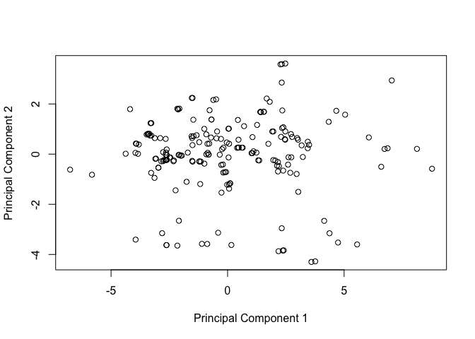
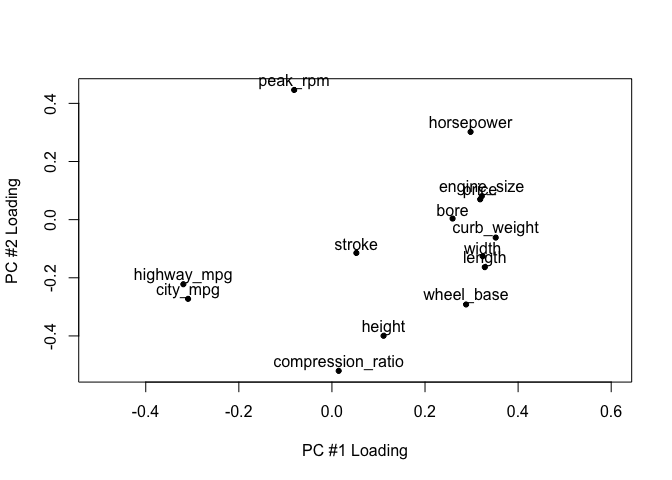
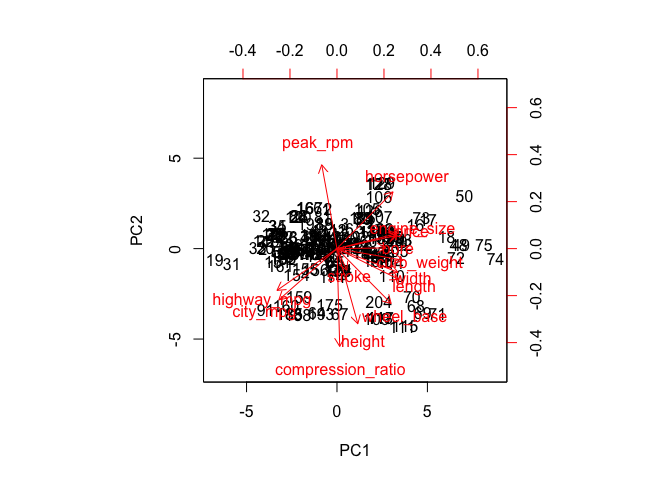

Homework 1
================
Jose Saavedra
2/22/2018

Problem 1
---------

The data dictionary can be found in the hw01 folder under imports-85-dictionary.txt

Problem 2
---------

Importing Data

``` r
names_columns <-  c('symboling',
                    'normalized_losses'
                    ,'make','fuel_type'
                    ,'aspiration',
                    'num_of_doors',
                    'body_style',
                    'drive_wheels',
                    'engine_location',
                    'wheel_base',
                    'length',
                    'width',
                    'height',
                    'curb_weight',
                    'engine_type',
                    'num-of_cylinders',
                    'engine_size',
                    'fuel_system',
                    'bore',
                    'stroke',
                    'compression_ratio',
                    'horsepower',
                    'peak_rpm',
                    'city_mpg',
                    'highway_mpg',
                    'price'
                    )
columns_types <- c('integer',
                   'real',
                   'character',
                   'character',
                   'character',
                   'character',
                   'character',
                   'character',
                   'character',
                   'real',
                   'real',
                   'real',
                   'real',
                   'integer',
                   'character',
                   'character',
                   'integer',
                   'character',
                   'real',
                   'real',
                   'real',
                   'integer',
                   'integer',
                   'integer',
                   'integer',
                   'integer'
                   )
autos <- read.csv(file = 'imports-85.data',
                  col.names = names_columns,
                  colClasses = columns_types,
                  na.strings = '?',
                  header = F)
str(autos)
```

    ## 'data.frame':    205 obs. of  26 variables:
    ##  $ symboling        : int  3 3 1 2 2 2 1 1 1 0 ...
    ##  $ normalized_losses: num  NA NA NA 164 164 NA 158 NA 158 NA ...
    ##  $ make             : chr  "alfa-romero" "alfa-romero" "alfa-romero" "audi" ...
    ##  $ fuel_type        : chr  "gas" "gas" "gas" "gas" ...
    ##  $ aspiration       : chr  "std" "std" "std" "std" ...
    ##  $ num_of_doors     : chr  "two" "two" "two" "four" ...
    ##  $ body_style       : chr  "convertible" "convertible" "hatchback" "sedan" ...
    ##  $ drive_wheels     : chr  "rwd" "rwd" "rwd" "fwd" ...
    ##  $ engine_location  : chr  "front" "front" "front" "front" ...
    ##  $ wheel_base       : num  88.6 88.6 94.5 99.8 99.4 ...
    ##  $ length           : num  169 169 171 177 177 ...
    ##  $ width            : num  64.1 64.1 65.5 66.2 66.4 66.3 71.4 71.4 71.4 67.9 ...
    ##  $ height           : num  48.8 48.8 52.4 54.3 54.3 53.1 55.7 55.7 55.9 52 ...
    ##  $ curb_weight      : int  2548 2548 2823 2337 2824 2507 2844 2954 3086 3053 ...
    ##  $ engine_type      : chr  "dohc" "dohc" "ohcv" "ohc" ...
    ##  $ num.of_cylinders : chr  "four" "four" "six" "four" ...
    ##  $ engine_size      : int  130 130 152 109 136 136 136 136 131 131 ...
    ##  $ fuel_system      : chr  "mpfi" "mpfi" "mpfi" "mpfi" ...
    ##  $ bore             : num  3.47 3.47 2.68 3.19 3.19 3.19 3.19 3.19 3.13 3.13 ...
    ##  $ stroke           : num  2.68 2.68 3.47 3.4 3.4 3.4 3.4 3.4 3.4 3.4 ...
    ##  $ compression_ratio: num  9 9 9 10 8 8.5 8.5 8.5 8.3 7 ...
    ##  $ horsepower       : int  111 111 154 102 115 110 110 110 140 160 ...
    ##  $ peak_rpm         : int  5000 5000 5000 5500 5500 5500 5500 5500 5500 5500 ...
    ##  $ city_mpg         : int  21 21 19 24 18 19 19 19 17 16 ...
    ##  $ highway_mpg      : int  27 27 26 30 22 25 25 25 20 22 ...
    ##  $ price            : int  13495 16500 16500 13950 17450 15250 17710 18920 23875 NA ...

``` r
library(readr)


autos2 <- read_csv(file = 'imports-85.data',
                   col_names = names_columns,
                   na='?',
                   col_types = list(
                   normalized_losses=col_double()
                   ))
str(autos2)
```

    ## Classes 'tbl_df', 'tbl' and 'data.frame':    205 obs. of  26 variables:
    ##  $ symboling        : int  3 3 1 2 2 2 1 1 1 0 ...
    ##  $ normalized_losses: num  NA NA NA 164 164 NA 158 NA 158 NA ...
    ##  $ make             : chr  "alfa-romero" "alfa-romero" "alfa-romero" "audi" ...
    ##  $ fuel_type        : chr  "gas" "gas" "gas" "gas" ...
    ##  $ aspiration       : chr  "std" "std" "std" "std" ...
    ##  $ num_of_doors     : chr  "two" "two" "two" "four" ...
    ##  $ body_style       : chr  "convertible" "convertible" "hatchback" "sedan" ...
    ##  $ drive_wheels     : chr  "rwd" "rwd" "rwd" "fwd" ...
    ##  $ engine_location  : chr  "front" "front" "front" "front" ...
    ##  $ wheel_base       : num  88.6 88.6 94.5 99.8 99.4 ...
    ##  $ length           : num  169 169 171 177 177 ...
    ##  $ width            : num  64.1 64.1 65.5 66.2 66.4 66.3 71.4 71.4 71.4 67.9 ...
    ##  $ height           : num  48.8 48.8 52.4 54.3 54.3 53.1 55.7 55.7 55.9 52 ...
    ##  $ curb_weight      : int  2548 2548 2823 2337 2824 2507 2844 2954 3086 3053 ...
    ##  $ engine_type      : chr  "dohc" "dohc" "ohcv" "ohc" ...
    ##  $ num-of_cylinders : chr  "four" "four" "six" "four" ...
    ##  $ engine_size      : int  130 130 152 109 136 136 136 136 131 131 ...
    ##  $ fuel_system      : chr  "mpfi" "mpfi" "mpfi" "mpfi" ...
    ##  $ bore             : num  3.47 3.47 2.68 3.19 3.19 3.19 3.19 3.19 3.13 3.13 ...
    ##  $ stroke           : num  2.68 2.68 3.47 3.4 3.4 3.4 3.4 3.4 3.4 3.4 ...
    ##  $ compression_ratio: num  9 9 9 10 8 8.5 8.5 8.5 8.3 7 ...
    ##  $ horsepower       : int  111 111 154 102 115 110 110 110 140 160 ...
    ##  $ peak_rpm         : int  5000 5000 5000 5500 5500 5500 5500 5500 5500 5500 ...
    ##  $ city_mpg         : int  21 21 19 24 18 19 19 19 17 16 ...
    ##  $ highway_mpg      : int  27 27 26 30 22 25 25 25 20 22 ...
    ##  $ price            : int  13495 16500 16500 13950 17450 15250 17710 18920 23875 NA ...
    ##  - attr(*, "spec")=List of 2
    ##   ..$ cols   :List of 26
    ##   .. ..$ symboling        : list()
    ##   .. .. ..- attr(*, "class")= chr  "collector_integer" "collector"
    ##   .. ..$ normalized_losses: list()
    ##   .. .. ..- attr(*, "class")= chr  "collector_double" "collector"
    ##   .. ..$ make             : list()
    ##   .. .. ..- attr(*, "class")= chr  "collector_character" "collector"
    ##   .. ..$ fuel_type        : list()
    ##   .. .. ..- attr(*, "class")= chr  "collector_character" "collector"
    ##   .. ..$ aspiration       : list()
    ##   .. .. ..- attr(*, "class")= chr  "collector_character" "collector"
    ##   .. ..$ num_of_doors     : list()
    ##   .. .. ..- attr(*, "class")= chr  "collector_character" "collector"
    ##   .. ..$ body_style       : list()
    ##   .. .. ..- attr(*, "class")= chr  "collector_character" "collector"
    ##   .. ..$ drive_wheels     : list()
    ##   .. .. ..- attr(*, "class")= chr  "collector_character" "collector"
    ##   .. ..$ engine_location  : list()
    ##   .. .. ..- attr(*, "class")= chr  "collector_character" "collector"
    ##   .. ..$ wheel_base       : list()
    ##   .. .. ..- attr(*, "class")= chr  "collector_double" "collector"
    ##   .. ..$ length           : list()
    ##   .. .. ..- attr(*, "class")= chr  "collector_double" "collector"
    ##   .. ..$ width            : list()
    ##   .. .. ..- attr(*, "class")= chr  "collector_double" "collector"
    ##   .. ..$ height           : list()
    ##   .. .. ..- attr(*, "class")= chr  "collector_double" "collector"
    ##   .. ..$ curb_weight      : list()
    ##   .. .. ..- attr(*, "class")= chr  "collector_integer" "collector"
    ##   .. ..$ engine_type      : list()
    ##   .. .. ..- attr(*, "class")= chr  "collector_character" "collector"
    ##   .. ..$ num-of_cylinders : list()
    ##   .. .. ..- attr(*, "class")= chr  "collector_character" "collector"
    ##   .. ..$ engine_size      : list()
    ##   .. .. ..- attr(*, "class")= chr  "collector_integer" "collector"
    ##   .. ..$ fuel_system      : list()
    ##   .. .. ..- attr(*, "class")= chr  "collector_character" "collector"
    ##   .. ..$ bore             : list()
    ##   .. .. ..- attr(*, "class")= chr  "collector_double" "collector"
    ##   .. ..$ stroke           : list()
    ##   .. .. ..- attr(*, "class")= chr  "collector_double" "collector"
    ##   .. ..$ compression_ratio: list()
    ##   .. .. ..- attr(*, "class")= chr  "collector_double" "collector"
    ##   .. ..$ horsepower       : list()
    ##   .. .. ..- attr(*, "class")= chr  "collector_integer" "collector"
    ##   .. ..$ peak_rpm         : list()
    ##   .. .. ..- attr(*, "class")= chr  "collector_integer" "collector"
    ##   .. ..$ city_mpg         : list()
    ##   .. .. ..- attr(*, "class")= chr  "collector_integer" "collector"
    ##   .. ..$ highway_mpg      : list()
    ##   .. .. ..- attr(*, "class")= chr  "collector_integer" "collector"
    ##   .. ..$ price            : list()
    ##   .. .. ..- attr(*, "class")= chr  "collector_integer" "collector"
    ##   ..$ default: list()
    ##   .. ..- attr(*, "class")= chr  "collector_guess" "collector"
    ##   ..- attr(*, "class")= chr "col_spec"

Problem 3
---------

Technical Questions about importing data

a.) The first row becomes the column names, this is bad you can fix this by adding header=F.

b.)The code gives use all the data with generic column names V\#

c.)they become factors since the columns have at least one character, and a column of characters in dataframe are automatilly made as factors

d.)The main reason the second option is larger is due to the fact taht the first frame saves the characters as factors, which are stored in a ledger and called on when seen, where as in the second frame we store the charaters as unique characters so they take up more space.

e.)All character types are coerced as NA, and the integers are converted to reals

Problem 4
---------

Practice base plotting

``` r
hist(autos$price, col = c('blue','red', 'green'),xlab = 'Price in Dollar',
     main = 'Histogram of Prices of Autos')
```


``` r
boxplot(autos$horsepower, horizontal = T, main='Box plot og horsepower')
```


``` r
barplot(sort(table(autos$body_style), decreasing = T), col = c('red','blue'))
```


``` r
stars(autos[autos$aspiration=='turbo',][,c(10:13,26)],main = 'stars plot of cars with turbo',key.loc = c(18,3))
```


Problem 5
---------

Summaries

a.)

``` r
mean(autos[autos$fuel_type =='gas',]$price, na.rm = TRUE)
```

    ## [1] 12916.41

``` r
mean(autos[autos$fuel_type=='diesel',]$price, na.rm = TRUE)
```

    ## [1] 15838.15

b.)

``` r
autos[autos$num.of_cylinders=='twelve',]$make
```

    ## [1] "jaguar"

c.)

``` r
A <- aggregate(autos[,"make"], by=list(autos$make,autos$fuel_type),FUN = length)
A[which.max(A[A$Group.2=='diesel',]$x),]$Group.1
```

    ## [1] "peugot"

d.)

``` r
autos[which.max(autos$horsepower),]$price
```

    ## [1] NA

Note that the car with the largest horsepower has an unknown price and therefore we get the above result (car 130, make porsche)

e.)

``` r
Bottom10 <- range(autos$city_mpg, na.rm = T)
Bottom10[2] <- quantile(autos$city_mpg, probs = .1)
Bottom10
```

    ## [1] 13 17

the output in the range where the bottom 10% lie

f.)

``` r
Top10<- range(autos$highway_mpg, na.rm = T)
Top10[1] <- quantile(autos$highway_mpg, probs = .9)
Top10
```

    ## [1] 38 54

the output is the range where the top 10% lie

g.)

``` r
median(autos[autos$city_mpg<=Bottom10[2],]$price,na.rm = T)
```

    ## [1] 32250

Problem 6
---------

Technical Questions about data frames

a.) `dat$column_name` allows us to call on the column of name: column\_name, and treating this as a vector `dat$xyz` if xyz does not exist then R returns NULL

b.) Number 4 fails

c.)It fails since R doesn't understand that mpg is a name, this has to be explicitly denoted with a $ or "" or use row, column notation \[\]

d.)Yes since a data frame is at its basic structure a list, and you can append a list with a list since they are not atomic structures.

e.) returns a list of 11 numerical vectors with the associated names

f.) `as.data.frame()` can convert a list to a list into a data frame

Problem 7
=========

``` r
library(corrplot)
```

    ## corrplot 0.84 loaded

``` r
qdat <- cor(na.omit(autos[,c(10:14, 17, 19:26)]))
#corrplot number 1
corrplot(qdat, method = 'circle')
```


``` r
#corrplot number 2
corrplot(qdat, method = 'color', type = 'upper')
```

 Things that I noted, any descriptors to do with size are all postively correlated and anything to do with mileage and proformace is negatively correlated

Problem 8
---------

I went to office hours where the professor told discovered that he didnt mean to use qdat so the following is what we were supposed to do

### 8.1

``` r
PCA_autos <- prcomp(na.omit(autos[,c(10:14, 17, 19:26)]), scale. = T)
eigen_values <- PCA_autos$sdev^2
barplot(eigen_values, names.arg = colnames(PCA_autos$x))
```

 The first 3 Principal components capture

``` r
sum(eigen_values[1:3]/sum(eigen_values))*100
```

    ## [1] 78.76557

### 8.2

a.)

``` r
PC_1 <- PCA_autos$x
plot(PC_1[,1],PC_1[,2],cex=1, xlab = 'Principal Component 1', ylab = 'Principal Component 2')
```

 b.)

``` r
PC_loadings <- PCA_autos$rotation
plot(PC_loadings[,1],PC_loadings[,2],pch=19,cex=.7,
     xlab = "PC #1 Loading",ylab = "PC #2 Loading",
     xpd=T, xlim = c(-.5,.6))
text(PC_loadings[,1],PC_loadings[,2]+.03, labels = row.names(PC_loadings),cex = 1,xpd=T)
```



c.)

``` r
biplot(PCA_autos,scale = 0)
```



d.) From the loadings we can see that mpg variables are closely related, while the variables dealing with size are close.
